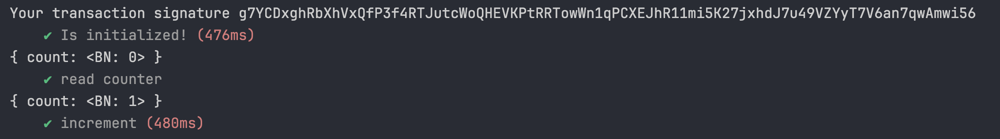

## 创建项目

首先，使用以下命令初始化一个新的 Anchor 项目：

```powershell
anchor init <project_name>
```

### 初始指令

在项目的 `lib.rs` 文件中，默认存在以下代码：

```rust
use anchor_lang::prelude::*;

declare_id!("8Tk87EnzKHdfEar8vjKE1HWa31nN5MGVDrAPPJgEFDSQ");

#[program]
pub mod l5_anchor {
    use super::*;

    pub fn initialize(ctx: Context<Initialize>) -> Result<()> {
        msg!("Greetings from: {:?}", ctx.program_id);
        Ok(())
    }
}
```

- `declare_id!` 宏用于声明程序的公钥
- `initialize` 一个合约指令，合约逻辑主要定义在这个函数中
- `Context<Initialize>` 表示当前合约指令需要的账户信息上下文。`Initialize` 是一个自定义的结构体，包含对应指令所需要的的账户

### 账户信息

在同一文件中，存在代码用于定义账户信息：

```rust
#[derive(Accounts)]
pub struct Initialize<'info> {
    #[account(mut)]
    pub payer: Signer<'info>,

    #[account(
        init,
        payer = payer,
        space = 8 + 8,
    )]
    pub counter: Account<'info, Counter>,

    pub system_program: Program<'info, System>,
}

#[account]
pub struct Counter {
    count: u64,
}
```

在这段代码中：

- `#[account()]` 宏的作用是标记账户字段，并指定其属性：
  - `mut`：表示该账户是可变的，即可以修改其内容
  - `init`：表示该账户需要初始化。初始化账户时，需要提供额外的参数：
    - `payer`：指定用于支付账户创建费用的账户
    - `space`：指定账户所需的空间大小。这里，8 字节用于存储账户元数据，8 字节用于存储 `Counter` 结构体中的 `count` 字段
- `<'info>` 生命周期参数用于指定账户的生命周期，确保账户在程序执行期间有效

这段代码帮助我们实现了原生 Solana 合约指令开头的 **解析输入账户列表** 操作：

```rust
let account_iter = &mut accounts.iter();

let user_account = next_account_info(account_iter)?;
let pda_account = next_account_info(account_iter)?;
let system_program = next_account_info(account_iter)?;
```

## 合约测试

### 构建 & 部署

执行以下命令进行构建：

```powershell
anchor build
```

构建结果：

- **deploy 文件夹**：包含编译后的 `.so` 文件，用于部署
- **idl 文件夹**：包含一个 `.json` 文件，描述合约中的指令信息。前端可以基于该文件进行编写，类似后端接口文档

执行以下命令将合约部署到指定环境：

```powershell
anchor deploy
```

也可以使用一键构建并部署的命令：

```powershell
anchor build && anchor deploy
```

### 测试文件

位于 `tests` 文件夹内的 `.ts` 文件，其中包含默认的测试代码：

```typescript
import * as anchor from "@coral-xyz/anchor";
import { Program } from "@coral-xyz/anchor";
import { Test } from "../target/types/test";

describe("test", () => {
  // Configure the client to use the local cluster.
  anchor.setProvider(anchor.AnchorProvider.env());

  const program = anchor.workspace.Test as Program<Test>;

  it("Is initialized!", async () => {
    // Add your test here.
    const tx = await program.methods.initialize().rpc();
    console.log("Your transaction signature", tx);
  });
});
```

- `anchor.setProvider(anchor.AnchorProvider.env());`：使用 anchor.toml 中的配置的环境变量，下面是一些常用字段的说明：

```toml
[provider]
cluster = "devnet"  # 设置默认的Solana网络，常见的选项有 'devnet'、'testnet'、'mainnet'
wallet = "~/.config/solana/devnet.json"  # 设置钱包文件路径

[scripts] # 可执行脚本指令
test = "../node_modules/.bin/jest --preset ts-jest"
```

- `const program = anchor.workspace.Test as Program<Test>;`：获取程序实例
- `program.methods.initialize().rpc();`：调用合约中的 `initialize` 指令

### 报错：Cannot find module

项目默认采用 yarn 作为包管理工具，并且采用 Plug’n’Play（PnP） 模式。这是 Yarn 的一种新的依赖管理方式，它不再使用传统的 node_modules 目录，而是通过 PnP 机制来解析依赖，因此默认情况下代码编辑器会提示依赖不存在

可以通过修改编辑器配置来解决这个问题
1. 安装 vscode 插件 ZipFS
2. 执行命令 yarn dlx @yarnpkg/sdks vscode
3. 如果右下角有弹窗提示可以直接选 Allow。如果没有弹窗需要使用 shift+cmd+p 手动设置TypeScript 使用工作区版本

参考：https://yarn.dev.org.tw/getting-started/editor-sdks#vscode

### 指令调用

```typescript
it('Is initialized!', async () => {
  const provider = anchor.AnchorProvider.env();
  anchor.setProvider(provider);
  const wallet = provider.wallet as anchor.Wallet;

  const counterKeypair = new anchor.web3.Keypair();
  console.log('counterKeypair.publicKey:', counterKeypair.publicKey);

  // 调用合约内的指令
  const tx = await program.methods
    .initialize()
    .accounts({
      payer: wallet.publicKey,
      counter: counterKeypair.publicKey,
    })
    .signers([wallet.payer, counterKeypair])
    .rpc();
  console.log('Your transaction signature', tx);
});
```

- `new anchor.web3.Keypair();`：创建一个新的密钥对
- `program.methods.initialize().accounts(...).signers([...]).rpc();`：调用合约中的 `initialize` 指令，并指定相关账户和签名者

### 结果验证

可以通过打印初始化之后的 `counter` 账户来验证合约的执行结果：

```typescript
it('read counter', async () => {
  const counterPubkey = new anchor.web3.PublicKey(
    'Ck67P8FeKmiB1vLjvqG55WLDq57xHt5Zvf5pBZdwzSwn'
  );
  const currentCount = await program.account.counter.fetch(counterPubkey);
  console.log(currentCount);
});
```

- `new anchor.web3.PublicKey('...');`：创建一个新的公钥实例
- `program.account.counter.fetch(counterPubkey);`：获取指定公钥的 `counter` 账户信息

运行测试代码需要使用以下命令：

```powershell
anchor test
```

执行该命令会自动进行一系列操作，包括：构建 -> 部署 -> 启动本地验证节点 -> 运行测试代码

## 新增指令

### 指令代码

```rust
#[program]
pub mod l5_anchor {
    ...
    pub fn increment(ctx: Context<Increment>) -> Result<()> {
        // 增加计数器值
        ctx.accounts.counter.count.checked_add(1).unwrap();

        Ok(())
    }
}

#[derive(Accounts)]
pub struct Increment<'info> {
    #[account(mut)]
    pub counter: Account<'info, Counter>,
}
```

这段代码新增了一个指令 `increment`。该指令接收一个 counter 账户，并对counter 中存储的信息进行修改

### 测试代码

```typescript
it('increment', async () => {
  // 计数器账户的 PublicKey（这应该是一个已初始化的账户）
  const counterPubkey = new anchor.web3.PublicKey(
    'DB33hppT8HFkbJoMHRsrSGwofHAGrk9Ymza726yZFhTa'
  )

  // 调用合约中的 increment 指令
  await program.methods
    .increment()  // 调用 increment 方法
    .accounts({
      counter: counterPubkey,  // 传入计数器账户
    })
    .rpc()  // 执行交易并等待确认

  // 获取执行后的计数器账户信息
  const currentCount = await program.account.counter.fetch(counterPubkey)
  console.log(currentCount)  // 打印当前计数器的值
})
```

通过 program.account.counter.fetch(counterPubkey) 获取 counter 账户的最新信息。再次执行anchor run test运行测试代码，可以看到打印的 count 已经增加为 1




