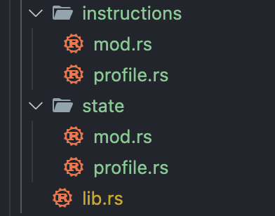

## 创建用户

### 指令代码

```rust
use anchor_lang::prelude::*;

declare_id!("HP6WSaNe8wjPhp3b9EfVwxnbWa2oYPpYTBnJpEpQrN3C");

#[program]
pub mod l6_anchor_social {
    use super::*;

    pub fn create_user(ctx: Context<CreateUser>, user_name: String) -> Result<()> {
        ctx.accounts.profile.user_name = user_name;
        Ok(())
    }
}

#[derive(Accounts)]
pub struct CreateUser<'info> {
    #[account(
        init,
        payer = authority,
        space = 8 + UserProfile::INIT_SPACE,
        seeds = [b"profile", authority.key().as_ref()],
        bump
    )]
    pub profile: Account<'info, UserProfile>,

    #[account(mut)]
    pub authority: Signer<'info>,

    pub system_program: Program<'info, System>,
}

#[account]
#[derive(InitSpace)]
pub struct UserProfile {
    #[max_len(20)]
    user_name: String,
}
```

#### 代码解析

- **`create_user` 指令**
   该指令会根据传入的用户名 `user_name` 创建一个用户的 `profile`，并将其存储在 Solana 账户中。使用 `ctx.accounts.profile.user_name = user_name;` 将用户名保存到 `UserProfile` 账户

- **`#[account]` 宏**

   - `#[account(init)]` 宏用于初始化账户，`payer` 是支付者账户，用于支付创建账户的费用
   - `space = 8 + UserProfile::INIT_SPACE` 指定了账户需要的存储空间，`8` 是账户元数据所需的空间，`UserProfile::INIT_SPACE` 代表 `UserProfile` 结构体占用的空间
   - `seeds = [b"profile", authority.key().as_ref()]` 定义了 `profile` 这一 pda 账户的种子，保证每一个用户的 profile 账户都是唯一的
   - `bump` seeds 必要的附加字段

- **`UserProfile` 结构体**
   - `#[max_len(20)]` 字符串类型需要限制最大长度，否则没办法计算占用空间
   - `#[derive(InitSpace)]` 可以帮我们自动计算账户所需的空间大小

### 模块划分

可以看到合约的代码如果都写在一个文件内是比较混乱的。为了更好地组织代码，我们将合约的内容拆分成多个模块

将前文 `lib.rs` 中的内容拆分到 `state`、`instructions` 模块中。其中 `instructions` 模块存放合约指令以及所需的账户信息，`state` 模块存放合约状态，lib 仅作为合约入口文件使用



#### `instructions` 模块

```rust
pub mod profile;

pub use profile::*;
```

在 `instructions/profile.rs` 文件中，我们定义了 `create_user` 指令：

```rust
use anchor_lang::prelude::*;

pub fn create_user(ctx: Context<CreateUser>, name: String) -> Result<()> {
    ctx.accounts.profile.name = name;
    Ok(())
}

use crate::state::*;

#[derive(Accounts)]
pub struct CreateUser<'info> {
    #[account(
        init,
        payer = authority,
        space = 8 + UserProfile::INIT_SPACE,
        seeds = [b"profile", authority.key().as_ref()],
        bump
    )]
    pub profile: Account<'info, UserProfile>,

    #[account(mut)]
    pub authority: Signer<'info>,

    pub system_program: Program<'info, System>,
}
```

#### `state` 模块

```rust
pub mod profile;

pub use profile::*;
```

在 `state/profile.rs` 文件中，我们定义了用户数据结构：

```rust
use anchor_lang::prelude::*;

#[account]
#[derive(InitSpace)]
pub struct UserProfile {
    #[max_len(20)]
    pub name: String,
}
```

#### `lib.rs` 入口文件

```rust
use anchor_lang::prelude::*;

declare_id!("HP6WSaNe8wjPhp3b9EfVwxnbWa2oYPpYTBnJpEpQrN3C");

pub mod instructions;
pub mod state;

use instructions::*;
use state::*;

#[program]
pub mod l6_anchor_social {
    use super::*;

    pub fn create_user(ctx: Context<CreateUser>, name: String) -> Result<()> {
        instructions::profile::create_user(ctx, name)
    }
}
```

### 避免硬编码

将使用的 profile 账户的种子使用常量进行替换，避免硬编码

#### `state/profile.rs`

```rust
impl UserProfile {
    pub const SEED_PREFIX: &'static str = "profile";
}
```

#### `lib.rs`

```rust
seeds = [UserProfile::SEED_PREFIX.as_bytes(), authority.key().as_ref()],
```

## 对接合约指令

### 创建钱包

社交项目会用到多个账户，可以在 app/api 目录下创建 wallet.ts 文件编写钱包相关代码。一些通用的逻辑，例如 provider 相关代码可以直接从测试文件中复制，逻辑是一样的

```typescript
import * as anchor from "@coral-xyz/anchor";
import { Program } from "@coral-xyz/anchor";
import { L6AnchorSocial } from "../../target/types/l6_anchor_social";

let provider = anchor.AnchorProvider.env();
anchor.setProvider(provider);

const program = anchor.workspace.L6AnchorSocial as Program<L6AnchorSocial>;

export { provider, program };

// 本地钱包
export function getDefaultWallet() {
  return anchor.Wallet.local;
}

// 任意钱包，用于测试合约功能
export function getVisitorWallet() {
  const keypair = anchor.web3.Keypair.fromSecretKey(
    new Uint8Array([xxx]) // 私钥内容
  );

  return new anchor.Wallet(keypair);
}
```

### API 封装

在 `app/api/profile.ts` 中编写前端与合约的对接代码：

- 创建账户：

```typescript
export async function createProfile(wallet: anchor.Wallet, name: string) {
  program.methods.createProfile(name).rpc();
}
```

- 查询账户：

```typescript
export async function getProfile(wallet: anchor.Wallet) {
  const [pda] = anchor.web3.PublicKey.findProgramAddressSync(
    [Buffer.from("profile"), wallet.publicKey.toBuffer()],
    program.programId
  );

  program.account.userProfile.fetch(pda);
}
```

### API 调用

在 `app/index.ts` 中获取钱包账户并调用 API：

```typescript
import { createProfile, getProfile } from "./api/profile";
import { getDefaultWallet, getVisitorWallet } from "./api/wallet";

(async () => {
  const defaultWallet = getDefaultWallet();
  const visitorWallet = getVisitorWallet();

  const result1 = await createProfile(visitorWallet, "test_name_1");
  console.log(result1);

  const result2 = await getProfile(visitorWallet);
  console.log(result2);
})();
```

我们不是直接在测试文件中编写逻辑，所以不能用 `anchor test` 来运行代码，需要在 Anchor.toml 中新增一个指令用于运行 `app/index.ts` 文件。指令用到了 `ts-node` 包，需要先安装

```toml
[scripts]
test = "yarn run ts-mocha -p ./tsconfig.json -t 1000000 tests/**/*.ts"
api = "yarn run ts-node app/index.ts"
```

准备就绪后，使用 `anchor run api` 执行代码
