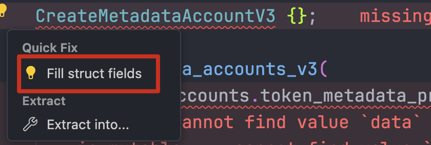
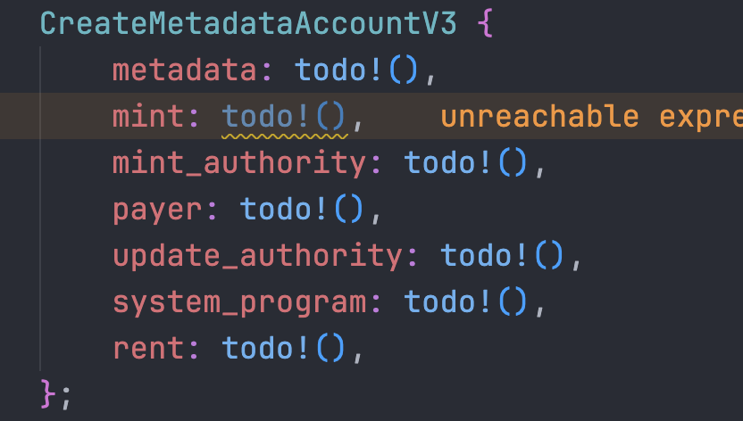

## 创建 Mint Account

### 添加依赖项

```typescript
[features]
default = []
cpi = ["no-entrypoint"]
no-entrypoint = []
no-idl = []
no-log-ix-name = []
+ idl-build = ["anchor-lang/idl-build", "anchor-spl/idl-build"]

[dependencies]
anchor-lang = "0.30.1"
+ anchor-spl = { version = "0.30.1", features = ["metadata"] }
```

- **idl-build**

  在 Anchor 框架中，idl-build 通常用于构建 IDL（Interface Definition Language） 文件。这些文件描述了你的 Solana 程序的接口，包括方法、参数和事件

  - anchor-lang/idl-build: 为你的 Solana 程序生成 IDL 文件。

  - anchor-spl/idl-build: 为使用 anchor-spl 提供的 SPL Token 方法或功能生成对应的 IDL 文件。

- **anchor-spl**

  Anchor 提供的库，用于支持与 **SPL（Solana Program Library）** 相关的功能

  ```typescript
  anchor-spl = { version = "0.30.1", features = ["metadata"] }
  ```

  metadata 特性主要支持与 SPL 元数据程序（例如 mpl-token-metadata）的交互。这个程序通常用于管理代币或 NFT 的元数据信息，例如代币名称、符号、URI 等

### 合约创建 Mint Account

```rust
#[derive(Accounts)]
pub struct CreateMintAccount<'info> {
    #[account(
        init,
        payer = authority,
        seeds = [b"mint"],
        bump,
        mint::decimals = 100,
        mint::authority = mint_account.key(),
    )]
    pub mint_account: Account<'info, Mint>,

    #[account(mut)]
    pub authority: Signer<'info>,

    pub system_program: Program<'info, System>,
    pub token_program: Program<'info, Token>
}
```

本质上就是初始化一个账户，所以关键代码只有账户相关的部分

- **decimals**

  翻译为小数，位数。表示这个代币能被分割到小数点后几位，例如：

  - decimals = 0：表示代币不可分割，最小单位是 1（比如 NFT）
  - decimals = 2：表示代币可以精确到小数点后 2 位，最小单位是 0.01（类似美元的“分”）

- 考虑到 Token 是作为帖子被关注的奖励发放给帖子作者的，我们将 `mint::authority` 设置为 `mint_account` 自身，保证由程序来控制 Token 的发放

### 启用 init_if_needed

同一个账户的多次初始化会导致报错，启用 init_if_needed 特性可以解决这个问题

```typescript
[dependencies]
anchor-lang = { version = "0.30.1", features = ["init-if-needed"] }
```

```rust
#[account(
    init_if_needed,
    payer = authority,
    seeds = [b"mint", authority.key().as_ref()],
    bump,
    mint::decimals = 100,
    mint::authority = authority.key(),
)]
pub mint_account: Account<'info, Mint>,
```

### 前端接入

```typescript
export function createMintAccount() {
  return program.methods.createMintAccount().rpc();
}
```

## 创建 Metadata Account

# Metadata Account

Token 的元数据（如名称、描述、图像 URL 等信息）本身并不存储在代币账户（Mint Account）中，而是存储在一个专门的 **Metadata Account**。在程序中 Metadata Account 由 Token Metadata Program 控制，种子是固定的：

1. b”metadata”

2. Token Metadata Program 地址

3. Mint Account 地址

另外还需要使用 `seed::program` 来声明其 `owner` 为 Token Metadata Program。这相当于 `findProgramAddressSync()` 的第二个参数

### 账户部分

```rust
#[derive(Accounts)]
pub struct CreateMintAccount<'info> {
    /// CHECK: Validate address by derving pda
    #[account(
        mut,
        seeds = [
            b"metadata",
            token_metadata_program.key().as_ref(),
            mint_account.key().as_ref()
        ],
        bump,
        seeds::program = token_metadata_program.key(),
    )]
    pub metadata_account: UncheckedAccount<'info>,

    #[account(
        init_if_needed,
        payer = authority,
        seeds = [b"lcrmint"],
        bump,
        mint::decimals = 100,
        mint::authority = authority.key(),
    )]
    pub mint_account: Account<'info, Mint>,

    #[account(mut)]
    pub authority: Signer<'info>,

    pub system_program: Program<'info, System>,
    pub token_program: Program<'info, Token>,
    pub token_metadata_program: Program<'info, Metadata>,

    pub rent: Sysvar<'info, Rent>,
}
```

- **UncheckedAccount**

Anchor 会对 Account 进行检查（例如标注 mut 的账户应当已经初始化），如果检查未通过会提示错误。`metadata_account` 的初始化通过在指令函数中调用 cpi 实现而非 Anchor 自动处理，因此这里使用 **UncheckedAccount** 避免 Anchor 对账户进行检查

- **Struct field "metadata_account" is unsafe, but is not documented**

```powershell
Struct field "metadata_account" is unsafe, but is not documented
```

使用 `UncheckedAccount` 会导致不安全，需要添加 `///CHECK` 注释才能成功构建（注意是三条杠）

### Cpi 调用

```rust
pub fn create_mint_account(ctx: Context<CreateMintAccount>) -> Result<()> {
    create_metadata_accounts_v3(
        CpiContext::new_with_signer(
            ctx.accounts.token_metadata_program.to_account_info(),
            CreateMetadataAccountsV3 {
                metadata: ctx.accounts.metadata_account.to_account_info(),
                mint: ctx.accounts.mint_account.to_account_info(),
                mint_authority: ctx.accounts.authority.to_account_info(),
                payer: ctx.accounts.authority.to_account_info(),
                update_authority: ctx.accounts.authority.to_account_info(),
                system_program: ctx.accounts.system_program.to_account_info(),
                rent: ctx.accounts.rent.to_account_info(),
            },
            &[&[
                b"lcrmint",
                &[ctx.bumps.mint_account],
            ]],
        ),
        DataV2 {
            name: "lcrtoken".to_string(),
            symbol: "lcrtoken".to_string(),
            uri: "https://lcrtoken.com".to_string(),
            seller_fee_basis_points: 0,
            creators: None,
            collection: None,
            uses: None,
        },
        false,
        true,
        None,
    )?;

    Ok(())
}
```

前文中有提到 Metadata Account 的初始化是通过 Cpi 调用实现的，具体来讲是使用了 `create_metadata_accounts_v3()` 这一函数。函数的参数看起来很多，其实只要 cmd + click 点进去查看源代码，按照参数类型填就行了。以下是几个关键点：

- **fill struct fields**

  「填充结构体字段」可以自动补全结构体的所有字段，值为 todo()。在编写复杂结构体代码非常有效

  

  

- **CpiContenxt::new_with_signer()**

  和 `CpiContext::new().with_signer()` 效果是一样的。PDA 作为 authority 的情况下需要 `with_signer()` 并填入 `signer_seeds`

- **signer_seeds**

  pda 的种子。考虑到可能存在多个 pda 的情况，类型指定为 `&[&[&[u8]]]`（多套了一层数组）。在账户部分的 bump 也要手动填入其中，获取方式为 `ctx.bumps.<account_name>`

  除此之外，如果作为一个变量单独声明必须注明其类型（&[&[&[u8]]]），否则 Rust 的类型推断会导致报错

### [test.validator]

以上代码并不能直接运行

```powershell
AnchorError: AnchorError caused by account: token_metadata_program. Error Code: InvalidProgramExecutable. Error Number: 3009. Error Message: Program account is not executable
```

原因是使用了 token_metadata_program 来创建 Metadata Account，而 token_metadata_program 并不是 Solana 官方提供的合约，本地环境里并没有部署

可以通过将下方代码添加到 Anchor.toml 中来解决这个问题。原理是将测试网络中的合约复制到本地

```typescript
[test.validator];
bind_address = "0.0.0.0";
url =
  "https://mainnet.helius-rpc.com/?api-key=fb252456-993c-4a77-9a32-3c7456029875";
ledger = ".anchor/test-ledger";
rpc_port = (8899)[[test.validator.clone]];
address = "metaqbxxUerdq28cj1RbAWkYQm3ybzjb6a8bt518x1s";
```

如果添加 `[test.validator]` 没有效果，大概率是由于网络问题。可以考虑将 token_metadata_program 下载到本地的方案，参考：

[How to Access Token Metadata Program ID on Localnet?](https://solana.stackexchange.com/questions/15733/how-to-access-token-metadata-program-id-on-localnet)
