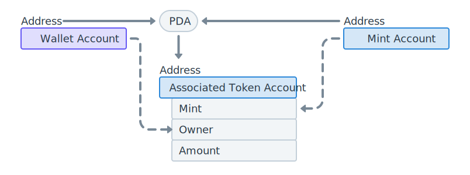

## 修改关注逻辑

### 增加账户

```rust
#[derive(Accounts)]
pub struct CreateLike<'info> {
    #[account(
        mut,
        seeds = [b"lcrmint"],
        bump
    )]
    pub mint_account: Account<'info, Mint>,

    /// CHECK: This is the author's wallet
    pub author_wallet: AccountInfo<'info>,

    #[account(
        init_if_needed,
        payer = authority,
        associated_token::mint = mint_account,
        associated_token::authority = author_wallet
    )]
    pub author_associated_token_account: Account<'info, TokenAccount>,

    #[account(
        init,
        payer = authority,
        space = 8 + Like::INIT_SPACE,
        seeds = [
            Like::SEED_PREFIX.as_bytes(),
            post.key().as_ref(),
            profile.key().as_ref()
        ],
        bump
    )]
    pub like: Account<'info, Like>,

    #[account(mut)]
    pub post: Account<'info, Post>,

    pub profile: Account<'info, UserProfile>,

    #[account(mut)]
    pub authority: Signer<'info>,

    pub system_program: Program<'info, System>,
    pub token_program: Program<'info, Token>,
    pub associated_token_program: Program<'info, AssociatedToken>,
}
```

- `associated_token_account`

  associated_token_account（关联代币账户），简称 ata。具有特定地址的代币账户，其地址通过 程序派生地址（PDA） 生成。种子取 Mint Account + Wallet Account，用于表示某个钱包拥有的某种代币的数量

  

- `author_associated_token_account` 是作者的 ata，用于接收关注帖子获得的 token 收益。需要指定 `associated_token::mint` 以及 `associated_token::authority` 两个参数

- `author_wallet` 帖子作者的钱包，作为 ata 账户的持有者

- `mint_account` 之前创建的 Token

- `associated_token_program` 账户包含 ata 时需要将该程序引入，anchor 会使用该程序帮我们初始化 ata

### 修改指令

在关注帖子的函数中添加代码，帖子被关注后给帖子的作者发放 token 作为奖励

```rust
pub fn create_like(ctx: Context<CreateLike>) -> Result<()> {
    let profile = &ctx.accounts.profile;

    let post = &mut ctx.accounts.post;
    post.like_count += 1;

    let like = Like::new(profile.key(), post.key());
    ctx.accounts.like.set_inner(like);

    mint_to(
        CpiContext::new_with_signer(
            ctx.accounts.token_program.to_account_info(),
            MintTo {
                mint: ctx.accounts.mint_account.to_account_info(),
                to: ctx
                    .accounts
                    .author_associated_token_account
                    .to_account_info(),
                authority: ctx.accounts.authority.to_account_info(),
            },
            &[&[b"lcrmint", &[ctx.bumps.mint_account]]],
        ),
        100,
    )?;

    Ok(())
}
```

## 结果验证

我们没有新增任何指令，只是修改了原来的逻辑，因此前端不需要修改。重新执行关注帖子的逻辑后，通过终端指令或 [Solana Explorer](https://explorer.solana.com/?cluster=custom&customUrl=http://localhost:8899) 查看作者账户拥有的代币
