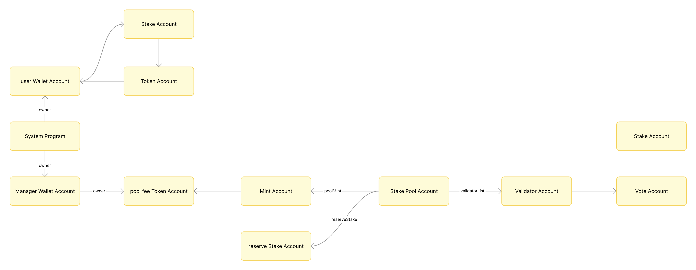

## 简介

### 什么是质押

用户可以将代币锁定，以此来获得额外收益。锁定之后的代币是无法使用的

### 为什么要质押

PoS 网络中的 validator 负责确认交易和区块制作，他们所拥有的权重由质押决定。具体权重可以在 [Solana Beach](https://solanabeach.io/validators) 上查看

### 质押方式

质押一般通过以下几种方式实现：

1. 使用钱包 app 操作质押

2. 使用 Solana CLI 命令

3. 合约代码操作质押

### 分类

- **原生质押（Native Staking）**

调用 solana 原生程序生成一个质押账户，将账户中的资金质押到某个验证节点。质押的原始资金和收益被有权限的账户提现，全部提现后质押账户将被立即销毁

- **流动质押（Liquid Staking）**

进行原生质押后，质押账户中的 SOL 是无法参与交易的。而流动质押中的质押资金是可以正常交易的。具体来说用户将代币质押给质押池，质押池提供给用户对应的衍生代币，这些代币可以也可以在区块链生态上进行交易

流动质押通过衍生代币的增值来获得收益。例如，1 stETH 最初兑换 1 ETH，随着奖励积累可能变为 1.05 ETH，这时卖出衍生代币就可以兑换出更多的原生代币

## 质押池

用户将自己的代币存入一个共享的质押池，池内的资产由质押协议或节点运营者统一管理和质押。有点类似理财产品

### 如何创建质押池

通过 Solana CLI 就能创建质押池，质押池的管理员可以设置一系列参数，包括：

- 每个 epoch 的管理费用
- 质押的手续费
- 提现的手续费
- 介绍费

### 质押池账户模型

