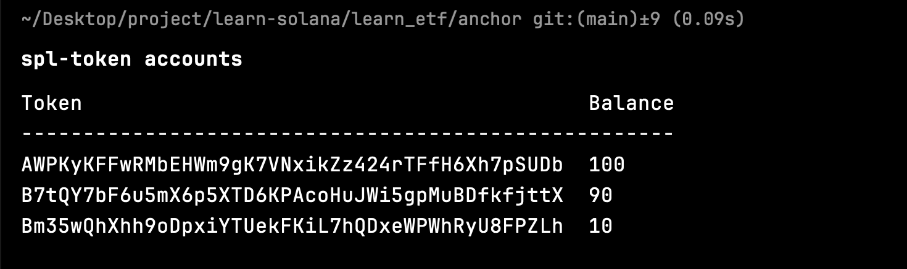

## 基本思路

假设存在一种 ETF，包含 10% token A + 80% token B

当前价格：

- 1 A = 1.1 SOL
- 1 B = 1.3 SOL

用户计划购买 100 份 ETF，需要花费

$100 \times 10\% \times 1.1 + 100 \times 90\% \times 1.3 = 128（SOL）$

### 方案 1：前端 swap

1. 用户通过 ray 或 okx 平台将 128 SOL 换出 10 A + 90 B
2. 用户 Transfer 10 A + 90 B 到合约
3. 合约 Mint 100 ETF 给用户

### 方案 2：合约 swap

1. 用户 Transfer 128 SOL 到合约
2. 合约通过 ray 或 okx 平台将 128 SOL 换出 10 A + 90 B
3. 合约 Mint 100 ETF 给用户

方案 1 的合约内容较为简单，因此我们先对方案 1 进行实现

## 合约代码

### 资产转移

```rust
pub fn etf_token_mint<'info>(
    ctx: Context<'_, '_, '_, 'info, EtfTransactionCtx<'info>>,
    lamports: u64,
) -> Result<()> {
    let assets = &ctx.accounts.etf_token_info_account.assets;

    let remaining_accounts = ctx
        .remaining_accounts
        .iter()
        .map(|x| (x.key(), x.to_owned()))
        .collect::<HashMap<_, _>>();

    for item in assets {
        let amount = lamports * item.weight as u64 / 100;

        let from_ata = remaining_accounts
            .get(&get_associated_token_address(
                &ctx.accounts.authority.key(),
                &item.token,
            ))
            .ok_or(TokenMintError::InvalidAccounts)?;

        let to_ata = remaining_accounts
            .get(&get_associated_token_address(
                &ctx.accounts.etf_token_info_account.key(),
                &item.token,
            ))
            .ok_or(TokenMintError::InvalidAccounts)?;

        transfer(
            CpiContext::new(
                ctx.accounts.system_program.to_account_info(),
                Transfer {
                    from: from_ata.to_account_info(),
                    to: to_ata.to_account_info(),
                    authority: ctx.accounts.authority.to_account_info(),
                },
            ),
            amount,
        )?;
    }
    ...
}
```

- 考虑到 etf 创建时设置的 token 数量时不确定的，我们无法在 ctx 结构体中直接声明 etf 关联的代币账户，需要使用 `remaining_accounts` 的方式从前端传入

- `remaining_accounts` 的顺序可能和 `assets` 的顺序不一致，这里先将其转为哈希表，在 `assets` 遍历的过程中通过 `key` 值获取。获取失败则使用 `ok_or()` 抛出错误

- 遍历 `etf_token_info_account.assets`，使用其中记录的数据来计算用户需要支付的每一个对应代币的数量，并在最后进行转账操作

- 调用 `mint_to` 函数，为用户一定数量的 Mint ETF

### Mint ETF

```rust
pub fn etf_token_mint<'info>(
    ctx: Context<'_, '_, '_, 'info, EtfTransactionCtx<'info>>,
    lamports: u64,
) -> Result<()> {
    ...
    let etf_mint_account_key = ctx.accounts.etf_mint_account.key();
    let signer_seeds: &[&[&[u8]]] = &[&[
        b"etf_v1",
        etf_mint_account_key.as_ref(),
        &[ctx.bumps.etf_token_info_account],
    ]];

    mint_to(
        CpiContext::new(
            ctx.accounts.system_program.to_account_info(),
            MintTo {
                mint: ctx.accounts.etf_mint_account.to_account_info(),
                to: ctx.accounts.authority_etf_ata.to_account_info(),
                authority: ctx.accounts.etf_token_info_account.to_account_info(),
            },
        )
        .with_signer(signer_seeds),
        lamports,
    )?;

    Ok(())
}
```

## 前端代码

### 创建 ata

由于 etf 包含的代币数量是不确定的，没办法在 ctx 中声明 ata，所以我们需要手动初始化 ata 账户。需要初始化的 ata 有 token 数量 \* 2 个，分别对应用户和程序的 ata

```rust
eftArgs.assets.forEach(async item => {
    const [etfMintAccount] = anchor.web3.PublicKey.findProgramAddressSync(
        [Buffer.from("ETF_TOKEN"), Buffer.from(eftArgs.symbol)],
        program.programId
    );

    const [etf_token_info_account] =
        anchor.web3.PublicKey.findProgramAddressSync(
            [Buffer.from("etf_v1"), etfMintAccount.toBuffer()],
            program.programId
        );

    const user_ata = getAssociatedTokenAddressSync(
        item.token,
        payer.publicKey,
    );

    // 用户发送 token 的 ata
    try {
        await getAccount(provider.connection, user_ata);
    } catch (e) {
        await createAssociatedTokenAccount(
            provider.connection,
            payer.payer,
            item.token,
            payer.publicKey,
        );
    }

    const program_ata = getAssociatedTokenAddressSync(
        item.token,
        etf_token_info_account,
        true
    );

    // 合约接受 token 的 ata
    try {
        await getAccount(provider.connection, program_ata);
    } catch (e) {
        await createAssociatedTokenAccount(
            provider.connection,
            payer.payer,
            item.token,
            etf_token_info_account,
            {},
            TOKEN_PROGRAM_ID,
            ASSOCIATED_TOKEN_PROGRAM_ID,
            true
        );
    }

    console.log("user_ata", user_ata.toBase58());
    console.log("program_ata", program_ata.toBase58());
    });
```

使用 `getAccount()` 来尝试获取账户，获取失败则证明该账户没有初始化，然后再调用 `createAssociatedTokenAccount()` 进行初始化。也可以不使用前端代码，通过命令 `spl-token create-account {mint_account}` 来初始化账户

### 调用指令

```rust
it("mint_etf", async () => {
    const [etfMintAccount] = anchor.web3.PublicKey.findProgramAddressSync(
        [Buffer.from("ETF_TOKEN"), Buffer.from(eftArgs.symbol)],
        program.programId
    );

    const result = await program.methods
        .etfMint(new BN(100e9))
        .accounts({ etfMintAccount })
        .rpc();

    console.log(result);
});
```

- Rust 中的 u64 类型超出了 ts 的 number 类型范围，所以合约参数为 u64 时，前端的参数会被映射为 BN（Big Number）类型。要创建 BN 类型，可以使用 new BN()
- 代码中 `100e9` 表示 `100 * 10^9`，用于抵消使用 `spl-token mint {token_account} {amount}` 指令和代码 `mint_to()` 函数这两种给你方法 mint 代币时的产生的单位差异

### 传递 remainingAccounts

```rust
const remainingAccounts = eftArgs.assets.flatMap(item => {
    const user_ata = getAssociatedTokenAddressSync(
        item.token,
        payer.publicKey
    );

    const [etf_token_info_account] =
        anchor.web3.PublicKey.findProgramAddressSync(
            [Buffer.from("etf_v1"), etfMintAccount.toBuffer()],
            program.programId
        );

    const program_ata = getAssociatedTokenAddressSync(
        item.token,
        etf_token_info_account,
        true
    );

    return [
        {
            pubkey: user_ata,
            isWritable: true,
            isSigner: false,
        },
        {
            pubkey: program_ata,
            isWritable: true,
            isSigner: false,
        },
    ];
});
```

- 注意 remainingAccounts 有简单的类型要求，需要手动拼装一下数据结构
- 代码中多处调用 findProgramAddressSync 来获取 pda。考虑到后续可能会重复使用 ata，最好是能做一下封装，这里方便起见没有进行处理
- 创建 remainingAccounts 别忘了在指令调用处传入

```rust
it("mint_etf", async () => {
    ...
    const result = await program.methods
        .etfMint(new BN(100e9))
        .accounts({ etfMintAccount })
+       .remainingAccounts(remainingAccounts)
        .rpc();
    ...
});
```

### 合约测试

为了进行合约测试，我们可以在本地创建两个 token，并给自己 mint 一定量的代币。这里我们需要 2 对（4 个） `associated_token_account`，分别用于两种 token 的发送和接受。可以使用代码创建，或使用指令 `spl-token create-account {mint_account}`

成功执行合约之后，能看到多了一种新的代币（etf），用于置换的两种代币被扣除相应的数量


