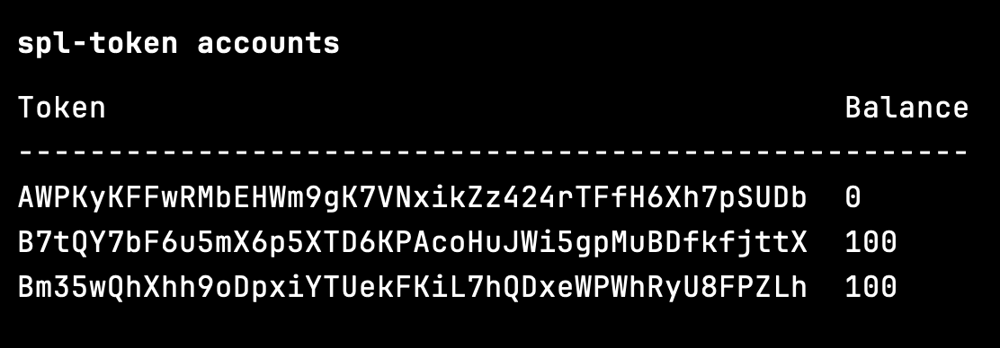

和购买逻辑完全相反，所以直接把代码复制一遍修改就好

## 合约代码

### 账户部分

和购买完全一致，直接复用就好。也可以将账户部分代码单独封装到一个模块中，供 ETF 的购买和赎回使用

```rust
#[derive(Accounts)]
pub struct EtfTransactionCtx<'info> {
    #[account(
        mut,
        seeds = [
            b"etf_v1",
            etf_mint_account.key().as_ref(),
        ],
        bump
    )]
    pub etf_token_info_account: Account<'info, EtfTokenInfo>,

    #[account(mut)]
    pub etf_mint_account: Account<'info, Mint>,

    #[account(
        init_if_needed,
        payer = authority,
        associated_token::mint = etf_mint_account,
        associated_token::authority = authority
    )]
    pub authority_etf_ata: Account<'info, TokenAccount>,

    #[account(mut)]
    pub authority: Signer<'info>,

    pub system_program: Program<'info, System>,
    pub token_program: Program<'info, Token>,
    pub associated_token_program: Program<'info, AssociatedToken>,
}
```

### 销毁 etf

转账完成后，合约内要执行 mint 的反向操作：burn

```rust
pub fn etf_burn<'info>(
    ctx: Context<'_, '_, '_, 'info, EtfTransactionCtx<'info>>,
    lamports: u64,
) -> Result<()> {
    burn(
        CpiContext::new(
            ctx.accounts.system_program.to_account_info(),
            Burn {
                mint: ctx.accounts.etf_mint_account.to_account_info(),
                from: ctx.accounts.authority_etf_ata.to_account_info(),
                authority: ctx.accounts.authority.to_account_info(),
            },
        ),
        lamports,
    )?;
    ...
}
```

### 转账操作

转账操作需要将 from 账户和 to 账户反过来。购买 etf 时，合约内用于接收用户 token 的 ata 设置的 authority 账户是 etf_token_info_acount，是一个 pda，在调用 transfer 时要加上 `.with_signer()`

```rust
pub fn etf_burn<'info>(
    ctx: Context<'_, '_, '_, 'info, EtfTransactionCtx<'info>>,
    lamports: u64,
) -> Result<()> {
    ...
    let assets = &ctx.accounts.etf_token_info_account.assets;

    let etf_mint_account_key = ctx.accounts.etf_mint_account.key();
    let signer_seeds: &[&[&[u8]]] = &[&[
        b"etf_v1",
        etf_mint_account_key.as_ref(),
        &[ctx.bumps.etf_token_info_account],
    ]];

    let remaining_accounts = ctx
        .remaining_accounts
        .iter()
        .map(|x| (x.key(), x.to_owned()))
        .collect::<HashMap<_, _>>();

    for item in assets {
        let amount = lamports * item.weight as u64 / 100;

        let from_ata = remaining_accounts
            .get(&get_associated_token_address(
                &ctx.accounts.etf_token_info_account.key(),
                &item.token,
            ))
            .ok_or(TokenMintError::InvalidAccounts)?;

        let to_ata = remaining_accounts
            .get(&get_associated_token_address(
                &ctx.accounts.authority.key(),
                &item.token,
            ))
            .ok_or(TokenMintError::InvalidAccounts)?;

        transfer(
            CpiContext::new(
                ctx.accounts.system_program.to_account_info(),
                Transfer {
                    from: from_ata.to_account_info(),
                    to: to_ata.to_account_info(),
                    authority: ctx.accounts.etf_token_info_account.to_account_info(),
                },
            )
            .with_signer(signer_seeds),
            amount,
        )?;
    }

    Ok(())
}
```

## 前端代码

前端代码和购买 etf 的逻辑几乎完全一样，只需要修改一下调用的指令名称。运行成功后，两种 token 应该恢复初始值（100）。etf 被清空但 ata 账户没有销毁，应显示 0


