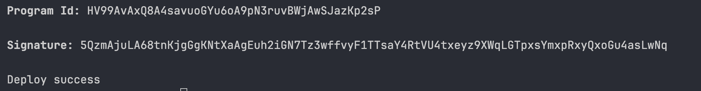
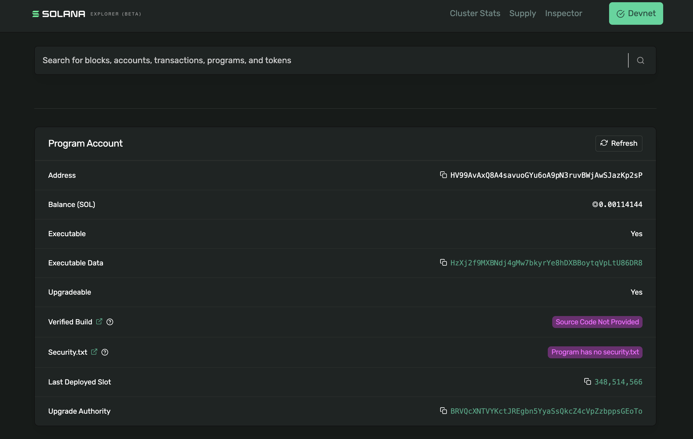

## 项目初始化

### 基本命令
以下是一些常用的 Anchor 命令：

- **`anchor init <project_name>`**：创建项目。
- **`anchor test`**：执行测试代码。
- **`anchor deploy`**：部署项目。

### 项目结构
执行命令 **`anchor init <project_name>`** 初始化项目后，项目结构如下：

```
.anchor/               # Anchor 项目的配置目录
.vscode/              # VSCode 编辑器相关配置
.yarn/                # Yarn 包管理目录
app/                  # 前端应用目录
migrations/           # 数据库迁移脚本目录
programs/             # Solana 程序（合约）源码目录
target/               # 编译输出目录
test-ledger/          # 本地测试账本
tests/                # 测试代码目录
.gitignore            # Git 忽略文件配置
.pnp.cjs              # Yarn PnP 配置文件
.pnp.loader.mjs       # Yarn PnP 加载器
.prettierignore       # Prettier 忽略文件配置
Anchor.toml           # Anchor 配置文件
Cargo.lock            # Rust 依赖锁定文件
Cargo.toml            # Rust 项目配置文件
package-lock.json     # npm 依赖锁定文件
package.json          # 项目依赖管理文件
tsconfig.json         # TypeScript 配置文件
yarn.lock             # Yarn 依赖锁定文件
```

### 依赖问题

项目默认采用 Yarn 作为包管理工具，并使用 Plug’n’Play（PnP）模式。这种模式不使用传统的 `node_modules` 目录，而是通过 PnP 机制解析依赖。这可能会导致代码编辑器提示依赖不存在。

可以通过修改编辑器配置解决此问题：

可以通过修改编辑器配置来解决这个问题

1. 安装 vscode 插件 ZipFS
2. 执行命令 yarn dlx @yarnpkg/sdks vscode
3. 使用 shift+cmd+p 设置 TypeScript 使用工作区版本

具体细节参考：[編輯器 SDK | Yarn 繁體中文](https://yarnpkg.com/advanced/editor-sdks)。

## 环境切换

在开发和部署 Solana 项目时，经常需要在本地环境（localnet）、开发网（devnet）、测试网（testnet）和正式网（mainnet-beta）之间切换。Anchor 提供了简单的配置方式，通过修改 Anchor.toml 文件即可完成切换。

Anchor.toml 文件中的 cluster 字段定义了当前的目标网络。例如：

```toml
[provider]
cluster = "devnet"
```

修改完成后，保存文件。接下来的所有测试和部署操作都会在指定的网络中执行。通过这种方式，开发者可以轻松在不同环境之间切换，确保代码在本地开发和远程部署时的行为一致

### 可选网络

* localnet：本地环境，适合开发和调试。
* devnet：Solana 官方提供的开发网络，适合测试。
* testnet：Solana 测试网络，通常用于更大规模的测试。
* mainnet-beta：Solana 主网，适合正式部署。

## Todo 程序代码实现

以下是一个简单的 Todo 程序实现：

```rust
#[program]
mod todo_program {
    use super::*;

    pub fn initialize(ctx: Context<Initialize>) -> Result<()> {
        let user_account = &mut ctx.accounts.user_account;
        user_account.todos = vec![];
        Ok(())
    }

    pub fn add_todo(ctx: Context<ModifyTodo>, task: String) -> Result<()> {
        let user_account = &mut ctx.accounts.user_account;
        user_account.todos.push(task);
        Ok(())
    }

    pub fn remove_todo(ctx: Context<ModifyTodo>, index: u64) -> Result<()> {
        let user_account = &mut ctx.accounts.user_account;
        if index < user_account.todos.len() as u64 {
            user_account.todos.remove(index as usize);
        }
        Ok(())
    }
}
```

## Devnet 部署

1. 修改 `Anchor.toml` 文件，将 `cluster` 字段改为 `devnet`：

   ```toml
   [provider]
   cluster = "devnet"
   ```

2. 执行部署命令：

   ```bash
   anchor deploy
   ```

3. 部署成功效果如下图所示


4. 可以在 [Solana Explorer](https://explorer.solana.com) 上通过 上图中的 program_id 查看部署的程序账户


