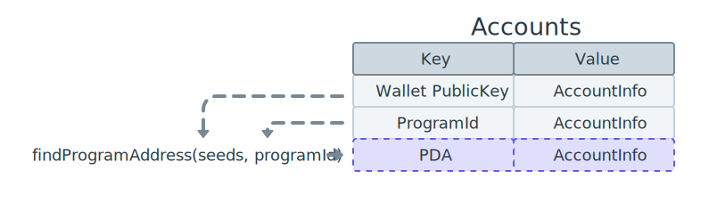

## Solana 账户模型

Solana 上数据的组织方式类似于键值存储，其中数据库中的每个条目称为“帐户”。每个帐户都可以通过其唯一地址进行识别，该地址以 **Ed25519 PublicKey** 格式表示为 32 字节。您可以将地址视为帐户的唯一标识符。账户与其地址之间的这种关系可以被认为是一个键值对，其中地址作为定位账户对应链上数据的键。


### 账户分类

#### 程序账户（Program Account）

在部署新 Solana 程序 时，会创建三个独立的帐户

- Program Account：代表链上程序的主账户，存储 rogram Executable Data Account 地址
- Program Executable Data Account：存储程序的可执行字节代码
- Buffer Account：在主动部署或升级程序时存储字节代码的临时帐户。该过程完成后，数据将传输到程序可执行数据帐户，并且缓冲区帐户将关闭
  Program Account 和 Program Executable Data Account 的关系可以用下图表示


#### 数据账户（Data Account）

Solana 程序是“无状态的”，这意味着程序帐户仅包含程序的可执行字节代码。要存储和修改其他数据，必须创建数据帐户
数据账户可以存储程序代码中定义的任意数据，它和 程序账户（Program Account） 的关系可以由下图表示


### Solana 程序

#### Native Programs（原生程序）

Solana 的原生程序是指那些内置在 Solana 区块链中的原生程序。它们是 Solana 网络不可或缺的一部分，由 Solana 团队开发和维护。这些程序直接运行在 Solana 的验证节点上，不需要额外的部署。它们的主要用途如下：

- **System Program**：处理账户创建、资金转账等基本操作。
- **Stake Program**：管理质押和权益分配。
- **Vote Program**：用于验证节点投票和共识机制。
- **BPFLoader Program**：专门用于加载和管理基于 Berkeley Packet Filter (BPF) 的智能合约或程序。

#### Custom Programs（自定义程序）

在 Solana 上，“智能合约”被称为程序。程序是包含可执行代码的帐户，并由设置为 true 的“可执行”标志指示。

## PDA（程序派生地址）

你可以将 **PDA（Program Derived Address）** 视为一种通过预定义的一组输入（例如字符串、数字和其他账户地址）在链上创建类似哈希映射结构的方法。派生一个程序派生地址并不会自动在该地址创建一个链上账户，必须通过用于派生地址的程序显式创建。



### 原理

Solana 链使用的 Ed25519 曲线是一种安全高效的加密算法。如果一个点 的坐标代入后满足椭圆曲线的方程，那么 P 被认为是曲线内的点，反之认为
​P 是曲线外的点

曲线内：是一把钥匙（公钥），可以用来加密和签名，有明确的配套私钥
曲线外：只是一个标志（类似门牌号），没有对应钥匙，不能用于加密操作，但可以作为一个安全的地址标识

PDA 是一个通过预定义的一组输入故意派生到 椭圆曲线（Ed25519） 之外的点，在曲线外的点没有对应的私钥。这能确保链上资源（如资金、数据、资产）始终由程序逻辑控制，从而防止未经授权的访问或操作


### 举例说明

#### 使用普通地址

假设我们开发了一个简单的应用，用户可以存入资金到一个共享账户中：

1. 应用生成一个普通账户 **Account A**，并将其私钥存储在服务器中。
2. 用户存款时，资金转入 **Account A**。
3. 提款或资金管理操作需要使用 **Account A** 的私钥进行签名。

问题：

1. 如果服务器被攻击，Account A 的私钥可能会泄露，导致资金被盗。
2. 开发者需要安全地存储和管理私钥，这增加了实现难度。

#### 使用 PDA

1. 程序通过种子（如 "shared_pool"）和程序 ID 生成一个 **PDA**，称为 **Account B**。
2. 用户存款时，资金转入 **Account B**。
3. 提款或资金管理由智能合约程序逻辑控制，无需签名，程序运行时验证权限。

## Solana 区块链交互

通过使用 Solana CLI，我们可以使用命令行与 Solana 区块链交互。而在代码中实现交互需要用到对应的开发工具库。

### 安装依赖

使用 `cargo add` 命令安装依赖：

```bash
cargo add solana_client solana_sdk
```

### 获取账户余额

```rust
let rpc_url = "http://127.0.0.1:8899";
let client = RpcClient::new(rpc_url);

let account_pubkey = Pubkey::from_str("BRVQcXNTVYKctJREgbn5YyaSsQkcZ4cVpZzbppsGEoTo").unwrap();

match client.get_balance(&account_pubkey) {
    Ok(balance) => println!("账户余额：{balance}"),
    Err(err) => println!("{err}")
};
```

由于 rpc_url 使用本地环境，需要先启动本地验证节点（solana-test-validator ）。代码中的公钥也使用命令获取（ solana address ）

### 申请空投

```rust
let amount = 1 * 1_000_000_000; // 1 SOL

match client.request_airdrop(&account_pubkey, amount) {
    Ok(_) => println!("申请成功"),
    Err(err) => println!("申请失败 {err}")
}
```

代码里的 amount 单位是 lamports，除以 10 亿（1_000_000_000）可转换为 SOL
需要注意的是申请空投后本地节点同步存在延迟，需要等待一段时间查询余额才能正确显示

### 账户转账

进行转账至少需要两个账户，编写代码前我们需要使用命令生成另一个账户（solana-keygen new）。直接运行该命令会提示是否覆盖已有的密钥文件，为了避免覆盖第一个账户，需要修改密钥存储地址

```bash
solana-keygen --outfile ~/.config/solana/id2.json
```

有两个账户后我们就可以通过代码完成本地环境中的转账操作，大概可以分为三个步骤

1. 创建转账命令
2. 新建交易
3. 执行并确认交易

```rust
let sender = read_keypair_file("/Users/xxx/.config/solana/id.json").unwrap();
let amount = 5 * 1_000_000_000; // 1 SOL

let transfer_instruction = system_instruction::transfer(&sender.pubkey(), &receiver_pubkey, amount);
let latest_blockhash = client.get_latest_blockhash().unwrap();
let transaction = Transaction::new_signed_with_payer(
    &[transfer_instruction],
    Some(&sender.pubkey()),
    &[&sender],
    latest_blockhash,
);

match client.send_and_confirm_transaction(&transaction) {
    Ok(_) => println!("转账成功"),
    Err(err) => println!("转账失败 {err}")
};
```

### 通过 RPC 获取账户信息

可以通过 RPC 获取到与提供的 Pubkey 帐户关联的所有信息，详情见：https://solana.com/zh/docs/rpc/http/getaccountinfo

```bash
curl http://127.0.0.1:8899 -s -X POST -H "Content-Type: application/json" -d '
  {
    "jsonrpc": "2.0",
    "id": 1,
    "method": "getAccountInfo",
    "params": [
      "公钥地址",
      {
        "encoding": "base58"
      }
    ]
  }
'
```

返回结果举例：

```bash
{
  "jsonrpc": "2.0",
  "result": {
    "context": { "apiVersion": "2.0.15", "slot": 341197053 },
    "value": {
      "data": ["", "base58"],
      "executable": false,
      "lamports": 88849814690250,
      "owner": "11111111111111111111111111111111",
      "rentEpoch": 18446744073709551615,
      "space": 0
    }
  },
  "id": 1
}
```
