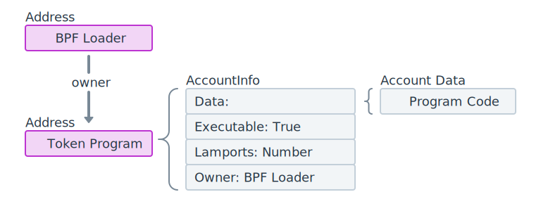
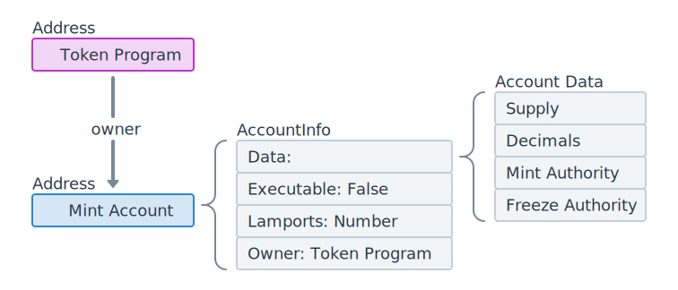
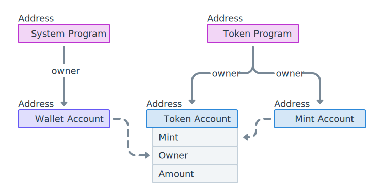
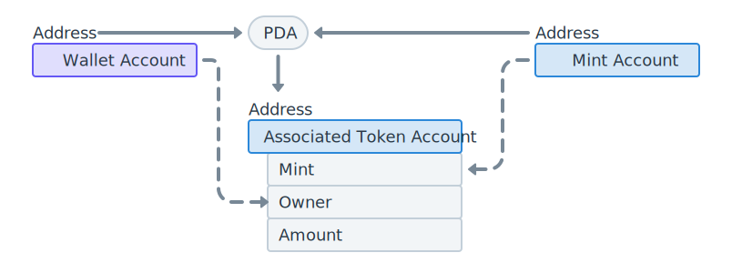
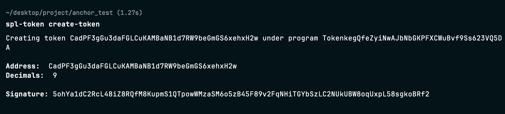
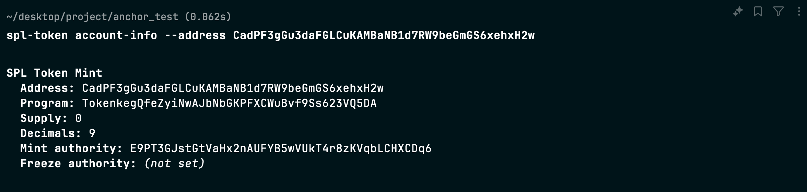
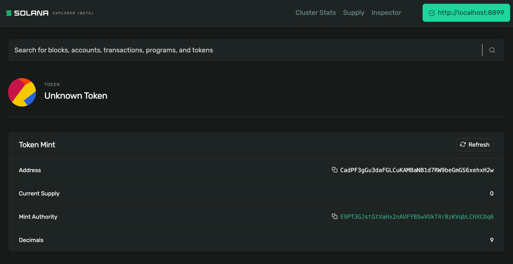
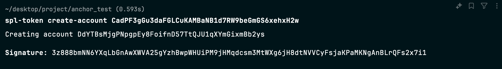

## Solana 上的代币

代币是代表对各种资产所有权的数字资产，在 Solana 上可以分为两种：

- **可替代代币（Fungible Token）**：比如 USDC，可以拆分并互换。
- **不可替代代币（Non-Fungible Token, NFT）**：比如数字艺术品，具有唯一性。

SPL 是 Solana 的标准代币实现。SPL 是 Solana Program Library 的缩写，指的是一组为 Solana 区块链构建的开源程序（智能合约）集合。这些程序为开发者提供了构建区块链应用的基础功能，例如代币的管理。基于 SPL 程序创建的代币被称为 SPL 代币。

当然，也有非 SPL 的代币类型，比如 Solana 网络的原生代币 SOL。

### 核心概念

#### 代币程序（Token Program）

包含与网络上的代币（包括可替代和不可替代）交互的所有指令逻辑
Solana 上的所有代币实际上都是由代币程序拥有的 数据账户（Data Account）



#### 铸造账户（Mint Account）

每种代币都有一个对应的 Mint Account，其地址作为代币的唯一标识
除此之外铸造账户还用于存储代币信息，例如：

- 供应量：代币的总供应量
- 小数位：代币的小数精度
- 铸造权限：有权创建新代币单位的账户，从而增加供应量
- 冻结权限：有权冻结代币账户中代币转移的账户
  它和 代币程序（Token Program）的关系如下



#### 代币账户（Token Account）

代币账户的核心作用是 跟踪每个特定代币单位的个人所有权
如果要查询某个钱包的某种代币的数量，需要使用两个索引，即所有者+代币类型。而单个代币账户就可以直接作为索引地址
| 代币账户地址 | 代币类型（铸造账户） | 所有者（钱包地址） | 数量 |
| :------- | :--------- | :-------- | :-- |
| 0xABC... | USDC 的铸造账户 | 0x123... | 100 |
| 0xDEF... | USDT 的铸造账户 | 0x123... | 50 |拥有代币账户后，转账可以直接用 代币账户 A -> 代币账户 B 表示，简化了转账逻辑



#### 关联代币账户（Associated Token Account, ATA）

具有特定地址的代币账户，其地址通过 程序派生地址（PDA） 生成



### 创建代币

想要创建一种新的代币，可以使用以下命令：

```bash
spl-token create-token
```

这个命令会在当前的区块网络中生成一个新的铸造账户（Mint Account）。



### 查看代币信息

可以通过以下方式查看代币的信息：

1. 使用命令：

   ```bash
   spl-token account-info --address {地址}
   ```



2. 或者通过区块浏览器查询相关地址。



### 创建关联代币账户

创建关联代币账户（ATA）非常简单：

```bash
spl-token create-account {铸造账户地址}
```

如果没有手动创建，但尝试与某个代币交互（比如接收或发送代币），发起转账时所使用的工具或程序可能会自动创建关联代币账户


