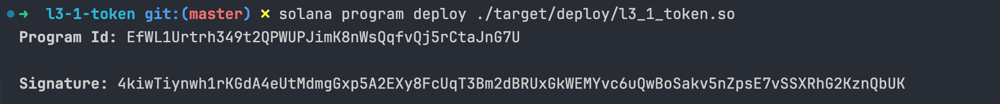

## 合约代码

### 项目初始化

新建文件夹后，在文件夹内执行 cargo init --lib 初始化项目

### 安装依赖

- **borsh**

  高效的二进制序列化框架，可以将代码中的结构化数据转化为二进制。在 Solana 中一般用于将创建出的指令序列化为二进制，传递给智能合约进行读取。

- **solana-program**

  Solana 程序开发的核心库，封装了与 系统程序（system_program） 交互所需的指令和工具。例如创建账户 create_account。

- **spl-token**

  代币操作相关，封装了与 代币程序（Token Program） 交互的指令和工具。

### 修改配置文件

在 Cargo.toml 中添加配置。如果不包含此配置，构建程序时将不会生成 target/deploy 目录。

```rust
[lib]
crate-type = ["cdylib", "lib"]
```

### 初始化入口文件（lib.rs）

Solana 程序需要提供一个入口文件，这个文件通常是 `lib.rs`。我们需要将初始化项目时 `lib.rs` 的默认内容替换为标准入口文件的写法

```rust
use solana_program::{
    account_info::AccountInfo, entrypoint, entrypoint::ProgramResult, msg, pubkey::Pubkey,
};

entrypoint!(process_instruction);

pub fn process_instruction(
    program_id: &Pubkey,
    accounts: &[AccountInfo],
    instruction_data: &[u8],
) -> ProgramResult {
    msg!("Hello, world!");
    Ok(())
}
```

### 初始化处理文件（processor.rs）

```rust
// processor.rs
use solana_program::{
    account_info::AccountInfo, entrypoint::ProgramResult, pubkey::Pubkey,
};

pub struct Processor;

impl Processor {
    pub fn process(
        program_id: &Pubkey,
        accounts: &[AccountInfo],
        instruction_data: &[u8],
    ) -> ProgramResult {}
```

```rust
// lib.rs
...
mod processor;
use create::proccessor::Processor;

pub fn process_instruction(
    ...
) -> ProgramResult {
    Processor::process(_program_id, _accounts, _instruction_data)
}
```

### 初始化指令文件（instruction.rs）

```rust
// instruction.rs
use borsh::{BorshDeserialize, BorshSerialize};

#[derive(BorshDeserialize, BorshSerialize)]
pub enum TokenInstruction {
    CreateToken { decimals: u8 },
    Mint { amount: u64 },
}
```

```rust
// processor.rs
...
use borsh:: BorshDeserialize;
use crate::instruction::TokenInstruction;

impl Processor {
    pub fn process(
        program_id: &Pubkey,
        accounts: &[AccountInfo],
        instruction_data: &[u8],
    ) -> ProgramResult {
        let instruction = TokenInstruction::try_from_slice(instruction_data);
        match instruction {
            TokenInstruction::CreateToken { decimals } => Self::create_token(accounts, decimals),
            TokenInstruction::Mint { amount } => Self::mint_token(accounts, amount),
        }
    }
}
```

### 创建代币

#### 解析输入账户列表

```rust
pub fn create_token(accounts: &[AccountInfo], decimals: u8) -> ProgramResult {
    let accounts_iter = &mut accounts.iter();

    let mint_account = next_account_info(accounts_iter)?;
    let mint_authority = next_account_info(accounts_iter)?;
    let payer = next_account_info(accounts_iter)?;
    let rent_sysvar = next_account_info(accounts_iter)?;
    let system_program = next_account_info(accounts_iter)?;
    let token_program = next_account_info(accounts_iter)?;
}
```

调用 create_token 需要多个账户信息，这些账户信息通过数组形式按顺序传入，在读取时使用 next_account_info 按顺序读取

#### 创建账户

```rust
...
invoke(
    &system_instruction::create_account(
        payer.key,
        mint_account.key,
        (Rent::get()?).minimum_balance(Mint::LEN),
        Mint::LEN as u64,
        token_program.key,
    ),
    &[
        mint_account.clone(),
        payer.clone(),
        system_program.clone(),
        token_program.clone(),
    ],
)?;
```

注意 create_account 指令的参数有顺序要求，具体顺序需要到源码中查找

#### 将账户初始化为铸造账户

```rust
...
let mint_init_ix = initialize_mint(
    token_program.key,
    mint_account.key,
    mint_authority.key,
    None,
    decimals,
)?;
invoke_signed(
    &mint_init_ix,
    &[
        mint_account.clone(),
        rent_sysvar.clone(),
        token_program.clone(),
        mint_authority.clone(),
    ],
    &[],
)?;
```

#### 部署程序

1. 使用 cargo build-spf 命令构建程序。这将创建target/deploy目录，生成<program-name>.so文件。

   SBF 是 Solana 定制的字节码格式，是 BPF 的一种扩展，专门为 Solana 区块链环境优化。SBF 在性能、功能和兼容性方面针对 Solana 生态进行了增强。

2. 使用 solana program deploy 命令部署程序，后跟由 cargo build-sbf 命令创建的 .so 文件的路径。可以通过重新部署来更新 Solana 程序。



### 铸造代币

和创建代币的逻辑类似，只是使用了不同指令

```rust
fn mint(amount: u64, accounts: &[AccountInfo]) -> ProgramResult {
let account_iter = &mut accounts.iter();

let mint_account = next_account_info(account_iter)?;
let associated_token_account = next_account_info(account_iter)?;
let rent_sysvar = next_account_info(account_iter)?;
let payer = next_account_info(account_iter)?;
let system_program = next_account_info(account_iter)?;
let token_program = next_account_info(account_iter)?;
let associated_token_program = next_account_info(account_iter)?;

if associated_token_account.lamports() > 0 {
    msg!("关联代币账户已存在")
} else {
    invoke(
        &spl_associated_token_account::instruction::create_associated_token_account(
            payer.key,
            payer.key,
            mint_account.key,
            token_program.key,
        ),
        &[
            payer.clone(),
            associated_token_account.clone(),
            mint_account.clone(),
            system_program.clone(),
            token_program.clone(),
            rent_sysvar.clone(),
            associated_token_program.clone(),
        ],
    )?;

    msg!("创建关联代币账户成功");
};

invoke(
    &mint_to(
        token_program.key,
        mint_account.key,
        associated_token_account.key,
        payer.key,
        &[payer.key],
        amount,
    )?,
    &[
        mint_account.clone(),
        payer.clone(),
        associated_token_account.clone(),
        token_program.clone(),
    ],
)?;
msg!("铸造成功，amount: {amount}");

Ok(())
}
```

## 客户端代码

新建一个 Rust 项目，调用部署的合约来创建代币

### 数据准备

#### 创建一个与 Solana 网络通信的 RPC 客户端

```rust
fn test_fn() {
    let rpc_client = RpcClient::new("http://127.0.0.1:8899".to_string());
}
```

#### 从本地路径加载支付账户（payer）的密钥对，用于支付创建账户所需的租金（lamports）和交易费用

```rust
fn test_fn() {
    ...
    let payer = read_keypair_file("/Users/lichaoran/.config/solana/id.json").expect("failed");
}
```

#### 使用合约的 id 创建 `program_id`，用于访问对应合约

```rust
fn test_fn() {
    ...
    let program_id = Pubkey::from_str("EfWL1Urtrh349t2QPWUPJimK8nWsQqfvQj5rCtaJnG7U").unwrap();
}
```

#### 创建一个新的密钥对，作为创建的代币账户的地址

```rust
fn test_fn() {
    ...
    let mint_account = Keypair::new();
}
```

#### 调用函数

```rust
fn test_fn() {
    ...
    create_token(
        &rpc_client,
        &program_id,
        &payer,
        &mint_account,
        &payer.pubkey(),
        6,
    ).unwrap();
}
```

### 调用合约创建代币

#### 将指令序列化成字节数组，供智能合约程序解析

```rust
pub enum TokenInstruction {
    CreateToken { decimals: u8 },
    Mint { amount: u64 },
}

fn create_token(
    rpc_client: &RpcClient,
    program_id: &Pubkey,
    payer: &Keypair,
    mint_account: &Keypair,
    mint_authority: &Pubkey,
    decimals: u8,
) -> Result<(), Box<dyn std::error::Error>> {
    let instruction_data = borsh::to_vec(&TokenInstruction::CreateToken { decimals }).unwrap();
}
```

#### 构建账户数组，作为合约输入的账户列表

```rust
fn create_token() {
    ...
    let accounts: Vec<AccountMeta> = vec![
        AccountMeta::new(creator.pubkey(), false),
        AccountMeta::new(mint_account.pubkey(), true),
        AccountMeta::new(system_program::id(), false),
        AccountMeta::new(spl_token::id(), false),
        AccountMeta::new_readonly(sysvar::rent::id(), false),
    ];
}
```

#### 构建指令

```rust
fn create_token() {
    ...
    let token_instruction = Instruction {
        program_id: *program_id,
        accounts,
        data: instruction_data,
    };
}
```

构建 `Instruction` 对象，包含以下信息

- program_id：要调用的智能合约
- accounts：执行合约需要的账户信息
- data：二进制形式的指令数据

#### 构建并签名交易

```rust
fn create_token() {
    ...
    let latest_blockhash = rpc_client.get_latest_blockhash()?;

    let tx = Transaction::new_signed_with_payer(
        &[token_instruction],
        Some(&payer.pubkey()),
        &[payer],
        latest_blockhash,
    );
}
```

Solana 上的个人钱包是由系统程序（system_program）拥有的账户。作为 Solana 账户模型 的一部分，只有拥有帐户的程序才允许修改帐户上的数据。因此，从“钱包”账户转移 SOL 需要发送一个交易来调用 System Program 上的转移指令。交易的发送者账户必须包含在交易上，作为交易的签名者（is_signner），以批准扣除他们的 lamport 余额

#### 发送和确认交易

```rust
fn create_token() {
    ...
    let r = rpc_client.send_and_confirm_transaction(&tx)?;
    println!("{:?}", r);
    println!("create token success");

    Ok(())
}
```

### 调用合约铸造代币

和创建代币的逻辑类似，以下是具体代码

```rust
fn mint_token(
    rpc_client: &RpcClient,
    creator: &Keypair,
    program_id: &Pubkey,
    mint_account: &Keypair,
) -> Result<(), Box<dyn std::error::Error>> {
    let ata = spl_associated_token_account::get_associated_token_address(
        &creator.pubkey(),
        &mint_account.pubkey(),
    );
    println!("{}", ata.to_string());

    let instruction_data = to_vec(&EnumTokenInstruction::MintToken { amount: 1000000 })?;

    let accounts = vec![
        AccountMeta::new(mint_account.pubkey(), false),
        AccountMeta::new(ata, false),
        AccountMeta::new(sysvar::rent::id(), false),
        AccountMeta::new(creator.pubkey(), true),
        AccountMeta::new(system_program::id(), false),
        AccountMeta::new(spl_token::id(), false),
        AccountMeta::new(spl_associated_token_account::id(), false),
    ];

    let token_instruction = Instruction {
        program_id: *program_id,
        accounts,
        data: instruction_data,
    };

    let recent_blockhash = rpc_client.get_latest_blockhash()?;

    let tx = Transaction::new_signed_with_payer(
        &[token_instruction],
        Some(&creator.pubkey()),
        &[creator, mint_account],
        recent_blockhash,
    );

    let r = rpc_client.send_and_confirm_transaction(&tx);
    println!("{:?}", r.unwrap());
    println!("铸造成功");
    println!("测试通过");

    Ok(())
}
```